# mathviz — 数学函数可视化工具

一个功能强大的 Python 数学函数分析与可视化工具，支持符号计算、数值分析、多种绘图模式和高级特性。

## 📋 项目简介

`mathviz` 是一个完整的数学科学计算项目，包含以下核心功能：

### 核心功能
- ✅ **符号解析** — 支持任意数学表达式（如 `sin(x)*exp(-x**2)`）
- ✅ **符号分析** — 自动计算导数、积分、泰勒展开
- ✅ **极值与拐点** — 求导数为零的点，二阶导数判别，三阶导数检测拐点
- ✅ **2D 绘图** — 单函数或多函数对比
- ✅ **3D 绘图** — 表面绘图（`--3d` 选项）

### 高级功能（加分项）
- ✅ **复变函数可视化** — 用颜色映射显示复函数的幅度或相位
- ✅ **隐函数绘图** — 绘制 f(x,y)=0 的隐曲线
- ✅ **参数方程** — 支持 2D 和 3D 参数曲线

## 🚀 快速开始

### 1. 安装与初始化

```powershell
cd mathviz
uv sync
```

这会创建虚拟环境并安装所有依赖。

### 2. 运行第一个示例

```powershell
uv run python -m mathviz.main --expr "sin(x)*exp(-x**2)" --xmin -5 --xmax 5
```

预期输出：
- 控制台打印出该表达式的导数、积分、泰勒展开、极值点和拐点
- 显示一个漂亮的 matplotlib 2D 图表

## 📖 详细使用方法

### 基础用法：绘制单个函数

```powershell
uv run python -m mathviz.main --expr "x**2 - 4*x + 3" --xmin -1 --xmax 5
```
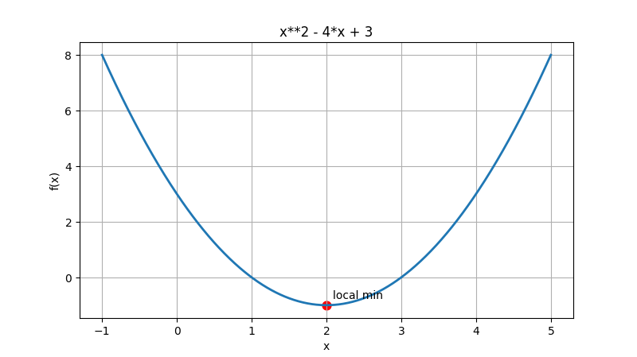
**输出内容包括：**
- 📊 符号分析：一阶导数、不定积分、6阶泰勒展开
- 🔍 极值点：分类为"local min"或"local max"
- 📐 拐点：三阶导数检测
- 📈 2D 图表

### 多函数对比

```powershell
uv run python -m mathviz.main --expr "sin(x);cos(x);sin(x)+cos(x)" --xmin -6.28 --xmax 6.28
```
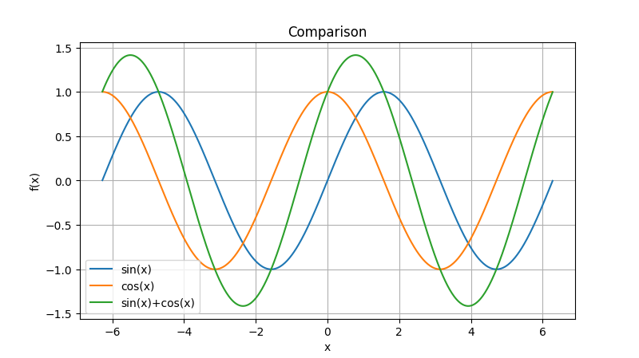

会在同一图表中绘制三条曲线，便于比较。

### 3D 表面绘图

```powershell
uv run python -m mathviz.main --expr "sin(x)*exp(-x**2)" --xmin -5 --xmax 5 --3d
```
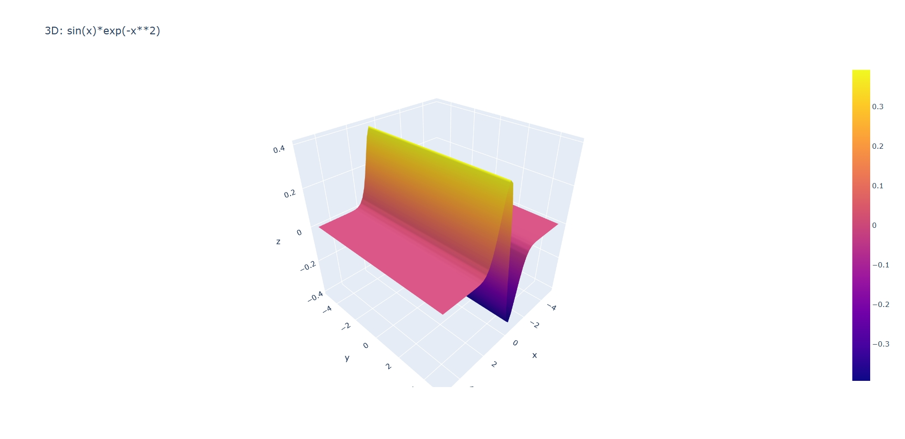
生成交互式 3D 曲面（使用 Plotly）。

### 复变函数可视化

```powershell
# 幅度模式（默认）
uv run python -m mathviz.main --complex "z**2" --xmin -2 --xmax 2 --ymin -2 --ymax 2

# 相位模式
uv run python -m mathviz.main --complex "sin(z)" --complex-mode phase --xmin -3 --xmax 3 --ymin -3 --ymax 3
```
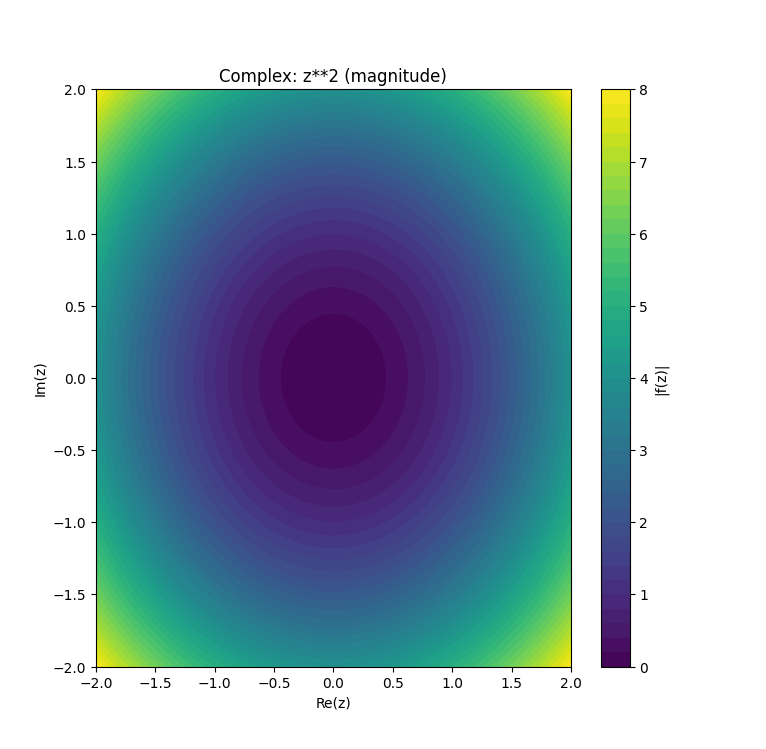
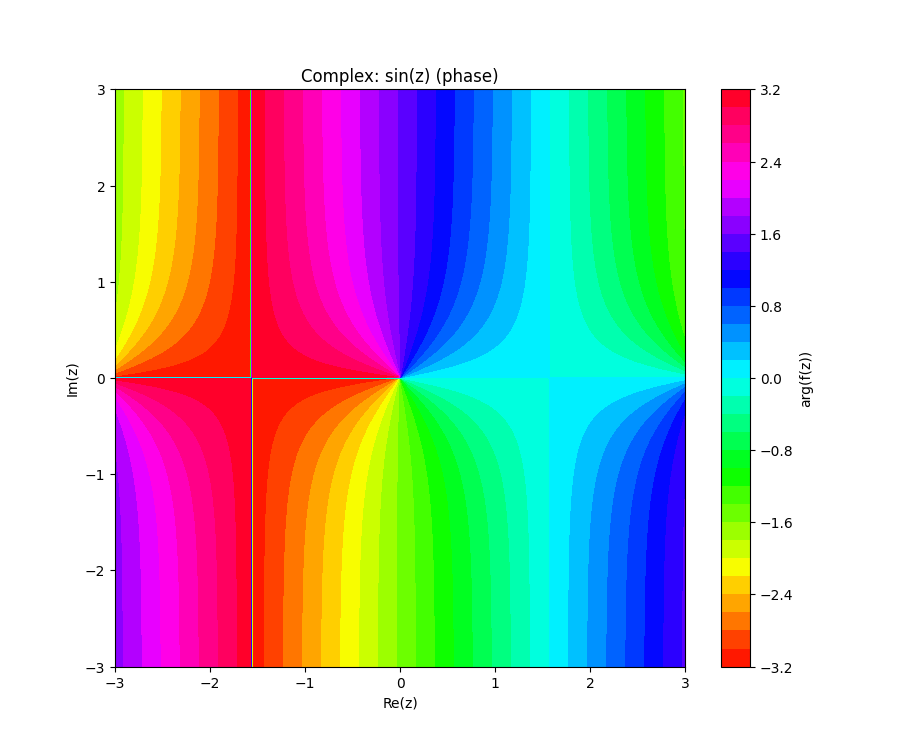

使用颜色映射可视化复函数 f(z)：
- `magnitude` 模式：用颜色表示 |f(z)|
- `phase` 模式：用颜色表示 arg(f(z))

### 隐函数绘图

```powershell
# 圆：x^2 + y^2 - 1 = 0
uv run python -m mathviz.main --implicit "x**2 + y**2 - 1" --xmin -1.5 --xmax 1.5 --ymin -1.5 --ymax 1.5

# 双曲线：x^2 - y^2 - 1 = 0
uv run python -m mathviz.main --implicit "x**2 - y**2 - 1" --xmin -3 --xmax 3 --ymin -3 --ymax 3
```
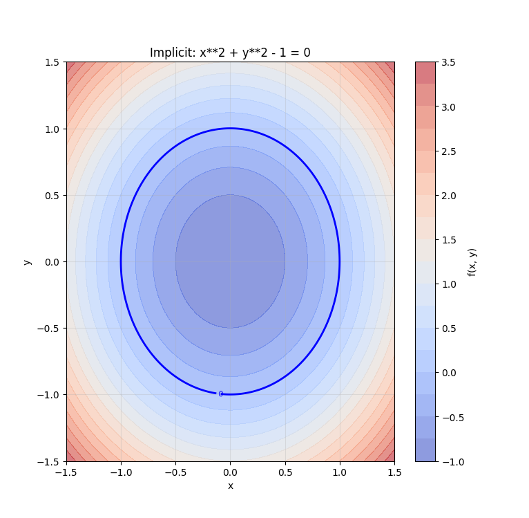
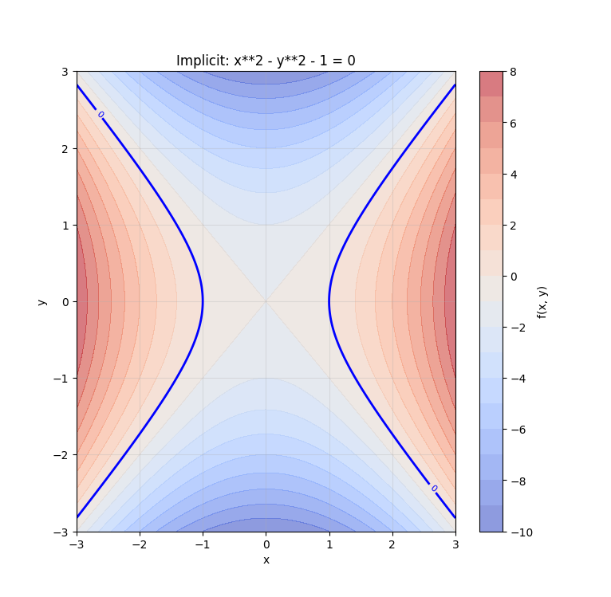

显示隐函数的零等高线。

### 参数方程（2D）

```powershell
# 圆：x = cos(t), y = sin(t), t ∈ [0, 2π]
uv run python -m mathviz.main --parametric-x "cos(t)" --parametric-y "sin(t)" --tmin 0 --tmax "2*pi"

# Lissajous 曲线
uv run python -m mathviz.main --parametric-x "sin(3*t)" --parametric-y "sin(2*t)" --tmin 0 --tmax "2*pi"
```
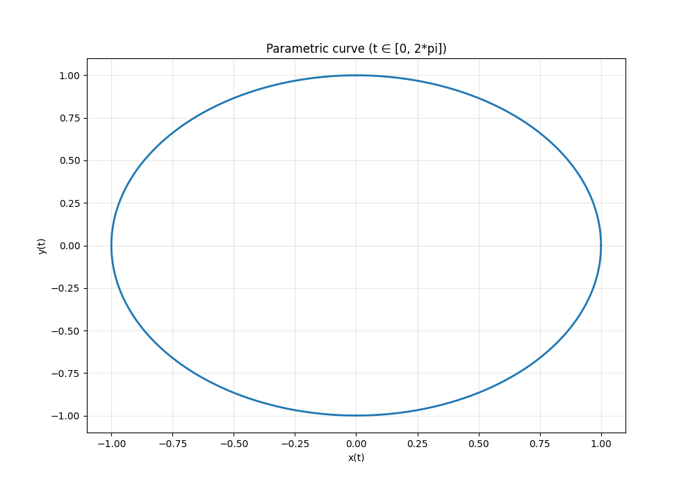
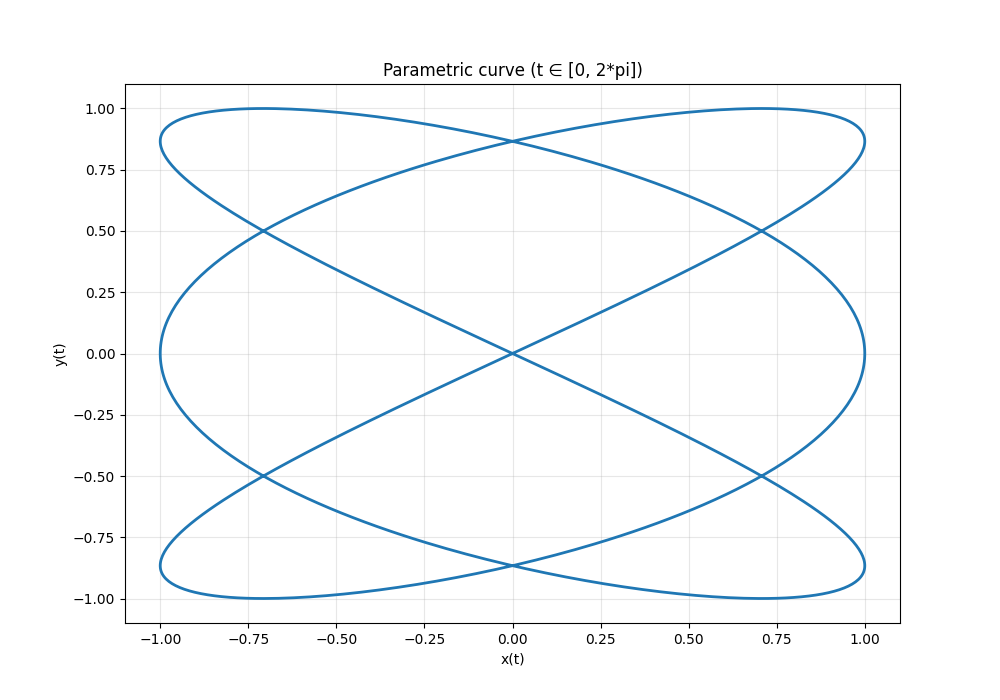

### 参数方程（3D）

```powershell
# 螺旋线：x = cos(t), y = sin(t), z = t
uv run python -m mathviz.main --parametric-x "cos(t)" --parametric-y "sin(t)" --parametric-z "t" --tmin 0 --tmax "4*pi"

# Tornado 螺旋
uv run python -m mathviz.main --parametric-x "t*cos(t)" --parametric-y "t*sin(t)" --parametric-z "0.1*t" --tmin 0 --tmax "10*pi"
```
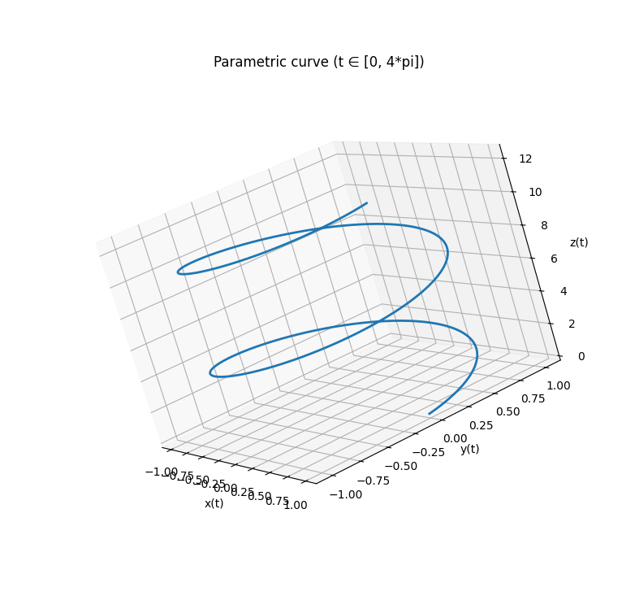
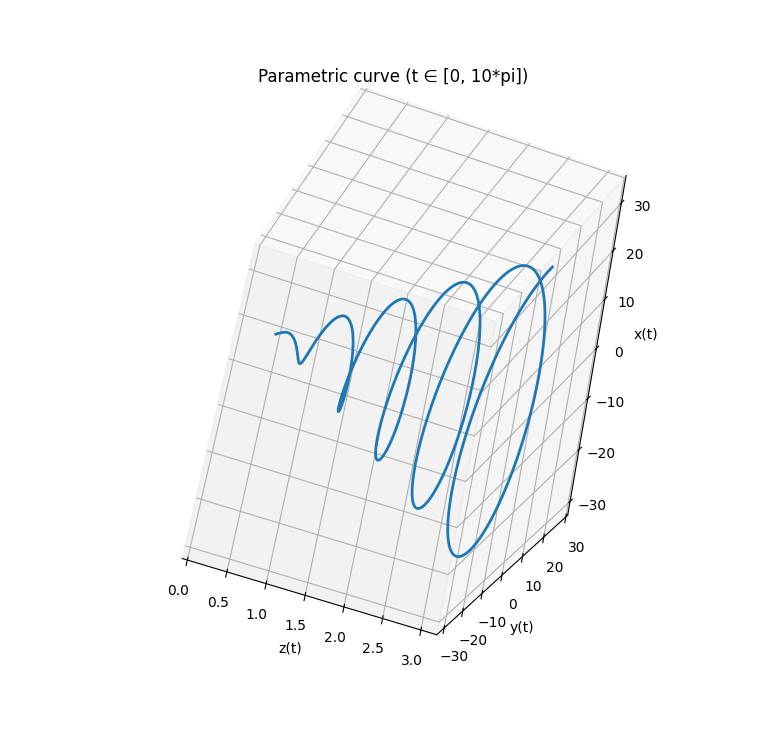

## 📊 命令行参数参考

| 参数 | 类型 | 默认值 | 说明 |
|------|------|--------|------|
| `--expr` | 字符串 | 必需 | 数学表达式，多个用`;`分隔 |
| `--xmin` | 浮点数 | -5.0 | x 轴最小值 |
| `--xmax` | 浮点数 | 5.0 | x 轴最大值 |
| `--ymin` | 浮点数 | -5.0 | y 轴最小值（隐函数用） |
| `--ymax` | 浮点数 | 5.0 | y 轴最大值（隐函数用） |
| `--points` | 整数 | 600 | 采样点数 |
| `--3d` | 标志 | 无 | 启用 3D 表面绘图 |
| `--save` | 路径 | 无 | 保存图像到指定路径 |
| `--complex` | 表达式 | 无 | 复变函数表达式（使用 `z`） |
| `--complex-mode` | 选择 | magnitude | `magnitude` 或 `phase` |
| `--implicit` | 表达式 | 无 | 隐函数表达式 f(x,y) |
| `--parametric-x` | 表达式 | 无 | 参数方程 x(t) |
| `--parametric-y` | 表达式 | 无 | 参数方程 y(t) |
| `--parametric-z` | 表达式 | 无 | 参数方程 z(t)（可选，3D） |
| `--tmin` | 表达式 | 0 | 参数 t 最小值（支持 `4*pi` 等） |
| `--tmax` | 表达式 | 2*pi | 参数 t 最大值（支持 `4*pi` 等） |

## 📓 Jupyter Notebooks

项目包含多个示例 notebook 展示不同功能：

```powershell
uv run jupyter notebook
```

然后在浏览器中打开以下文件：

1. **`notebooks/demo_plot.ipynb`** — 基础绘图示例（matplotlib）
2. **`notebooks/interactive.ipynb`** — 交互式绘图（Plotly）
3. **`notebooks/derivative_analysis.ipynb`** — 导数与极值分析
4. **`notebooks/3d_visualization.ipynb`** — 3D 曲面可视化
5. **`notebooks/advanced_features.ipynb`** — 泰勒级数、积分、多阶导数
6. **`notebooks/advanced_visualization.ipynb`** — 复变函数、隐函数、参数方程

## 🏗️ 项目结构

```
mathviz/
├── pyproject.toml           # 项目配置和依赖声明
├── uv.lock                  # 锁定的依赖版本（保证可复现）
├── .python-version          # Python 版本声明（3.11.4）
├── README.md                # 本文件
├── .gitignore               # Git 忽略规则
├── src/
│   └── mathviz/
│       ├── __init__.py
│       ├── main.py          # CLI 入口点
│       ├── analysis.py      # 符号分析（导数、积分、极值等）
│       └── plotter.py       # 绘图函数（2D、3D、复变、隐函数、参数）
├── notebooks/               # Jupyter notebook 示例
│   ├── README.md
│   ├── demo_plot.ipynb
│   ├── interactive.ipynb
│   ├── derivative_analysis.ipynb
│   ├── 3d_visualization.ipynb
│   ├── advanced_features.ipynb
│   └── advanced_visualization.ipynb
├── tests/
│   └── test_basic.py        # 基础单元测试
├── figures/                 # 生成的图表输出（可选）
└── data/                    # 数据文件（可选）
```

## 🛠️ 安装与依赖

**必需**：Python 3.11+

**依赖管理**：使用 `uv` 包管理器（推荐）

```powershell
# 初始化环境并安装依赖
uv sync

# 添加新依赖（自动更新 uv.lock）
uv add numpy scipy matplotlib sympy plotly jupyter

# 运行任何命令
uv run python -m mathviz.main --expr "sin(x)"
uv run jupyter notebook
uv run python -m pytest
```

**核心依赖**：
- `numpy` — 数值计算
- `scipy` — 高级科学计算
- `matplotlib` — 2D 绘图
- `sympy` — 符号计算
- `plotly` — 交互式 3D 绘图

## 🧪 开发与测试

```powershell
# 运行单元测试
uv run python -m pytest -q

# 运行特定测试
uv run python -m pytest tests/test_basic.py::test_derivative_sin -v
```

## 📦 可复现性保证

本项目设计遵循可复现性标准：

✅ `pyproject.toml` — 项目元数据和依赖声明
✅ `uv.lock` — 精确的依赖版本和哈希值
✅ `.python-version` — 指定 Python 版本（3.11.4）
✅ `.gitignore` — 排除虚拟环境和临时文件

**其他人可以这样快速复现你的项目：**

```powershell
git clone <你的仓库>
cd mathviz
uv sync
uv run python -m mathviz.main --expr "sin(x)"
```

## 📝 编码规范

- 所有函数都有 docstring 说明
- 类和模块有清晰的文档
- 代码结构清晰，易于扩展
- 使用类型注解提高代码可读性

## 🎓 学习资源

- [SymPy 文档](https://docs.sympy.org/)
- [Matplotlib 画廊](https://matplotlib.org/gallery/)
- [Plotly 文档](https://plotly.com/python/)
- [uv 包管理器](https://docs.astral.sh/uv/)

## 🤝 贡献与扩展

欢迎扩展本项目！可能的改进方向：
- 添加数值求解器（牛顿法、二分法等）
- 支持微分方程求解
- 添加更多高级曲线（Bezier、分形等）
- 交互式参数调整界面
- 导出为不同格式（SVG、PDF 等）

## 📄 许可证

MIT License

---

**作者** — 2119409636-rgb 
**更新时间** — 2025-12-03  
**Python 版本** — 3.11+

